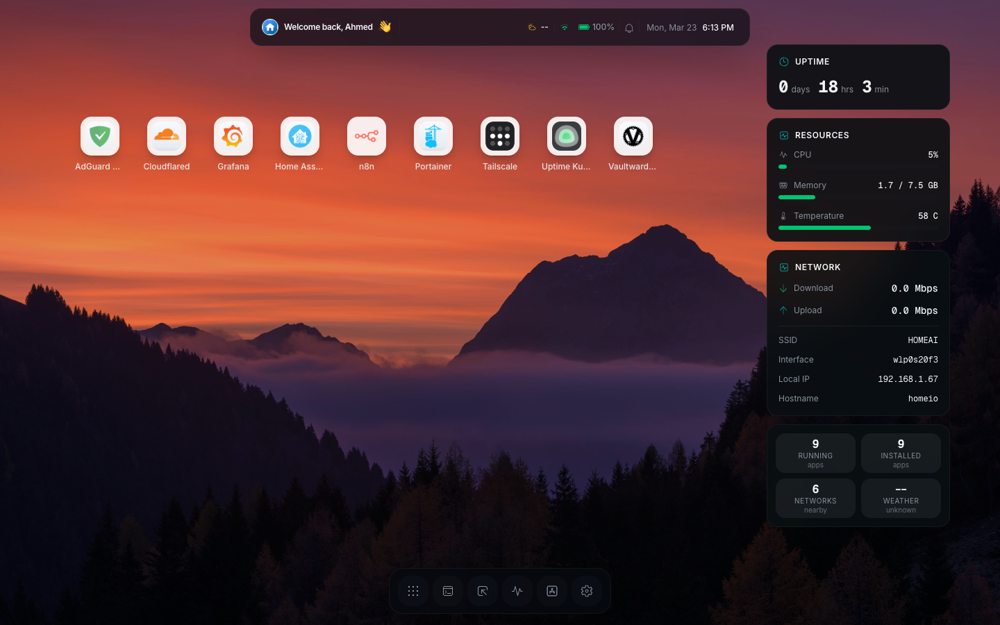
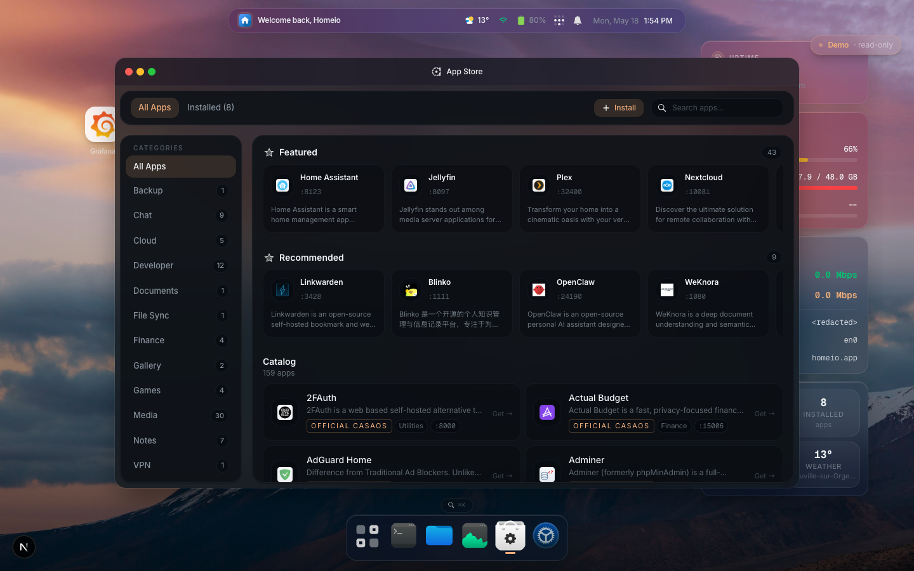
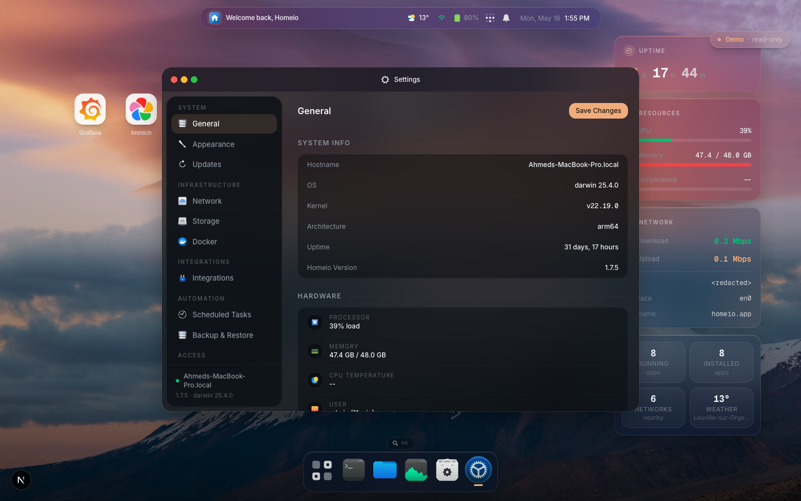
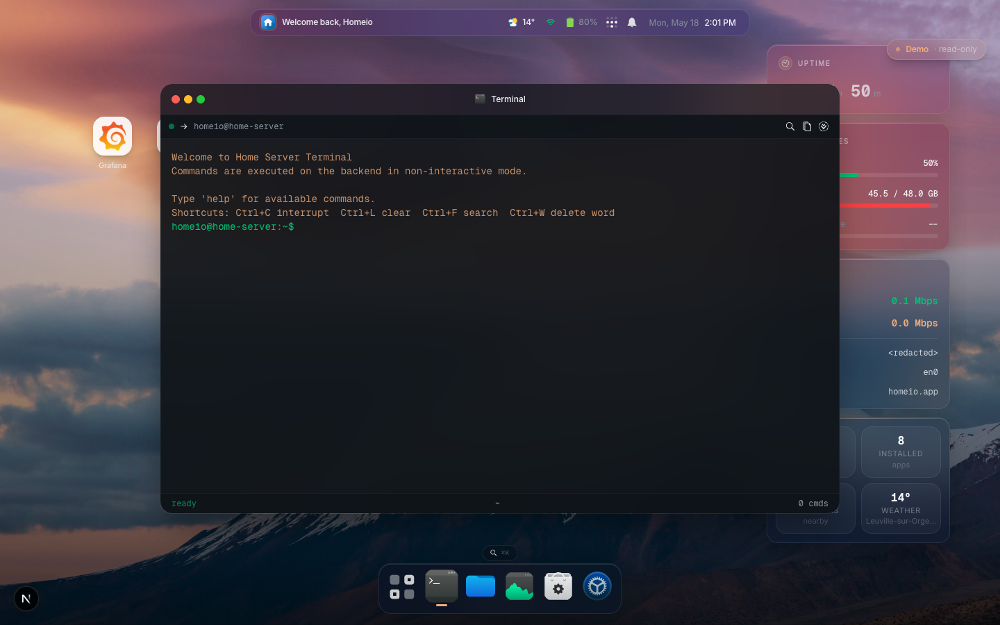

# Homeio

A self-hosted server manager with a desktop-style UI. Alternative to CasaOS, Umbrel, and Portainer — focused on a modern interface, real-time system visibility, and Docker app management.

## Screenshots

| Desktop | App Store |
|---------|-----------|
|  |  |

| Settings | Terminal |
|----------|----------|
|  |  |

## Features

- Desktop shell UI with dock, windows, command palette (`⌘K`), widgets, and lock screen
- Real-time system metrics (CPU, memory, disk, network) via SSE
- Server information dashboard with host, OS, CPU, memory, thermal, filesystem, and network-interface details
- App Store: install, update, uninstall Docker Compose apps — compatible with CasaOS store archives
- Container log viewer: real-time streaming, log-level badges, keyword filter, download
- File manager: browse, streaming upload with progress/cancel, download, unzip archives, multi-select copy/move, conflict resolution, audio/video/image/PDF preview, Monaco code editor
- Scheduled tasks: built-in cron runner for shell commands, app restarts, backups, and image pulls — no SSH required
- Notification system: real-time alerts for app events, container crashes, disk warnings, and task failures
- USB drive support: auto-detect, mount, browse, and eject removable drives from the file manager
- Local folder sharing over Samba and SMB network mount/unmount
- Google Drive integration: configure OAuth credentials, connect multiple accounts, browse, preview, upload, download, create folders, move, and delete Drive files from the file manager
- Disk and partition manager: list block devices, format, mount/unmount, create/delete partitions, and wipe disks with explicit confirmations
- Terminal with command allowlist (ls, cat, docker, df, ping, and more)
- Docker container stats in real time
- Network manager: WiFi and Ethernet via NetworkManager
- Weather widget with location-based conditions
- PostgreSQL-backed persistence

---

## Install

### Docker (recommended)

Requires Docker and Docker Compose.

```bash
docker compose up -d
```

Open `http://localhost:12026` → create your account → done.

Database is included — no external setup needed. On first run the app routes to `/register`. After you create your account, registration closes automatically.

> **Security:** change `AUTH_SESSION_SECRET` in `docker-compose.yml` before exposing outside your LAN.

**Update:**

```bash
docker compose pull && docker compose up -d
```

### Linux install script

For bare-metal or VM installs on Debian/Ubuntu/Raspberry Pi OS:

```bash
curl -fsSL https://raw.githubusercontent.com/doctor-io/homeio/main/scripts/install.sh | sudo bash
```

The app listens on `127.0.0.1:12026` and is exposed on `:80` via Nginx.

**Update:**

```bash
curl -fsSL https://raw.githubusercontent.com/doctor-io/homeio/main/scripts/update.sh | sudo bash
```

**Uninstall** (keeps data):

```bash
curl -fsSL https://raw.githubusercontent.com/doctor-io/homeio/main/scripts/uninstall.sh | sudo bash
```

**Full purge** (removes everything):

```bash
curl -fsSL https://raw.githubusercontent.com/doctor-io/homeio/main/scripts/uninstall.sh | sudo bash -s -- --purge --yes
```

---

## Security Notes

- Change `AUTH_SESSION_SECRET` to a random 32+ character string before exposing outside your LAN
- Put Homeio behind a TLS reverse proxy for HTTPS — the `Secure` cookie flag is set automatically when requests arrive over HTTPS
- The built-in terminal enforces a strict command allowlist — it is not a full shell

---

## Limitations

- **Single user** — one account per installation; registration closes after first setup
- **Linux only** — the install script targets Debian/Ubuntu/Raspberry Pi OS; Docker works on any platform
- **Network manager** — WiFi/Ethernet management requires NetworkManager with D-Bus
- **USB drive support** — requires `udisks2` and `udev` on the host; not available inside Docker without extra configuration
- **Disk manager** — destructive storage operations require bare-metal Linux tools (`parted`, `e2fsprogs`, `gdisk`) and should not be exposed to untrusted users
- **Google Drive** — requires a Google Cloud OAuth client configured in Settings → Integrations before accounts can connect
- **App Store hardware compatibility** — some templates require specific hardware (e.g. Raspberry Pi GPU); edit the compose file to remove optional hardware requirements

---

## Experimental Features

- **Shutdown** — shuts down the OS from the UI; requires physical power-on to recover
- **Factory reset** — wipes all Homeio data; irreversible
- **Disk wipe / format / partition changes** — irreversible host storage actions; every action requires explicit confirmation
- **Self-update rollback** — restores previous version on failed update; not tested under all failure scenarios

---

## Development

**Requirements:** Node.js 22.x, npm, PostgreSQL

```bash
npm install
cp .env.example .env.local
createdb home_server
npm run db:init
npm run dev
```

Open `http://localhost:3000`. Routes to `/register` if no users exist.

**Useful commands:**

```bash
npm run test        # Run tests
npm run lint        # ESLint
npm run build       # Production build
npm run db:migrate  # Run migrations
npm run db:reset    # Reset database (destructive)
```

---

## Telemetry

In production, Homeio sends one anonymous ping to [PostHog](https://posthog.com) on startup. This tells us how many instances are active and which versions are in use — nothing more.

What is collected: a random instance UUID (generated once, stored in your local database), Homeio version, Node.js version, CPU architecture, and OS platform. No IP address, no usernames, no file paths, no app names.

To opt out, set `HOMEIO_TELEMETRY=false` in your environment.

---

## Roadmap

See [ROADMAP.md](./ROADMAP.md) — current 1.6.x work focuses on storage expansion, Google Drive, safer uploads, and system visibility.

## Contributing

See [CONTRIBUTING.md](./CONTRIBUTING.md).

## License

MIT — see [LICENSE](./LICENSE).
