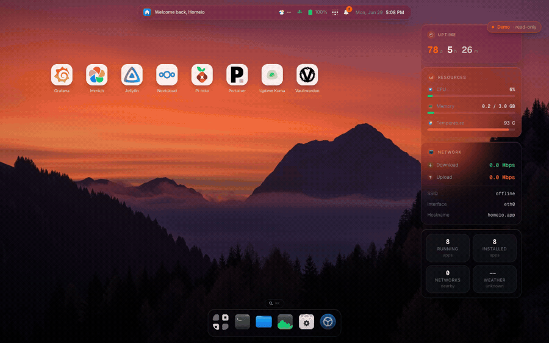

# Homeio

A self-hosted server manager with a desktop-style UI. Alternative to CasaOS, Umbrel, and Portainer — focused on a modern interface, real-time system visibility, and Docker app management.

<p align="center">
  <a href="https://github.com/doctor-io/homeio/stargazers"></a>
  <a href="https://demo.homeio.app"></a>
  <a href="https://github.com/doctor-io/homeio/blob/main/LICENSE"></a>
  <a href="https://github.com/sponsors/doctor-io"></a>
</p>

<p align="center">
  
</p>

<p align="center">
  <a href="https://demo.homeio.app"><strong>🖥️ Live demo</strong></a> &nbsp;·&nbsp;
  <code>homeio</code> / <code>homeio26</code>
  &nbsp;·&nbsp;
  <a href="https://github.com/doctor-io/homeio"><strong>⭐ Star on GitHub</strong></a>
  &nbsp;·&nbsp;
  <a href="https://github.com/sponsors/doctor-io"><strong>💖 Sponsor</strong></a>
</p>

## Screenshots

| Desktop | App Store |
|---------|-----------|
|  |  |

| Settings | Terminal |
|----------|----------|
|  |  |

## Features

- Desktop shell UI with dock, windows, command palette (`⌘K`), widgets, and lock screen
- Real-time system metrics (CPU, memory, disk, network) via SSE
- App Store: install, update, uninstall Docker Compose apps — compatible with CasaOS store archives
- Container log viewer: real-time streaming, log-level badges, keyword filter, download
- File manager: browse, upload (with progress), download, multi-select copy/move, conflict resolution, audio/video/image/PDF preview, Monaco code editor
- Scheduled tasks: built-in cron runner for shell commands, app restarts, backups, and image pulls — no SSH required
- Notification system: real-time alerts for app events, container crashes, disk warnings, and task failures
- USB drive support: auto-detect, mount, browse, and eject removable drives from the file manager
- Local folder sharing over Samba and SMB network mount/unmount
- Terminal with command allowlist (ls, cat, docker, df, ping, and more)
- Docker container stats in real time
- Network manager: WiFi and Ethernet via NetworkManager
- Tailscale integration: install, activate, and monitor your tailnet from Settings — reach your server from anywhere without port forwarding
- Google Drive: connect accounts over OAuth 2.0 and browse Drive alongside local and network locations in the file manager
- Two-factor authentication (TOTP) with backup codes — works with any authenticator app
- Disk manager and server info: drives, partitions, mount points, thermal sensors, and usage warnings
- Mobile app (preview): a Capacitor shell for Android and iOS that reaches your server over Tailscale
- Runs on amd64 and arm64 — Raspberry Pi 4/5 pull a native image
- PostgreSQL-backed persistence

---

## Install

### Docker (recommended)

Requires Docker and Docker Compose.

```bash
docker compose up -d
```

Open `http://localhost:12026` → create your account → done.

Database is included — no external setup needed. On first run the app routes to `/register`. After you create your account, registration closes automatically.

> **Security:** change `AUTH_SESSION_SECRET` in `docker-compose.yml` before exposing outside your LAN.

**Update:**

```bash
docker compose pull && docker compose up -d
```

### Linux install script

For bare-metal or VM installs on Debian/Ubuntu/Raspberry Pi OS:

```bash
curl -fsSL https://raw.githubusercontent.com/doctor-io/homeio/main/scripts/install.sh | sudo bash
```

The app listens on `127.0.0.1:12026` and is exposed on `:80` via Nginx.

**Update:**

```bash
curl -fsSL https://raw.githubusercontent.com/doctor-io/homeio/main/scripts/update.sh | sudo bash
```

**Uninstall** (keeps data):

```bash
curl -fsSL https://raw.githubusercontent.com/doctor-io/homeio/main/scripts/uninstall.sh | sudo bash
```

**Full purge** (removes everything):

```bash
curl -fsSL https://raw.githubusercontent.com/doctor-io/homeio/main/scripts/uninstall.sh | sudo bash -s -- --purge --yes
```

---

## Security Notes

- Change `AUTH_SESSION_SECRET` to a random 32+ character string before exposing outside your LAN
- Put Homeio behind a TLS reverse proxy for HTTPS — the `Secure` cookie flag is set automatically when requests arrive over HTTPS. One-click HTTPS over Tailscale arrives in v2.0; a built-in reverse proxy manager with automatic Let's Encrypt certificates follows in v2.1.
- Enable two-factor authentication (Settings → Users & Access) before exposing Homeio beyond your LAN
- The built-in terminal enforces a strict command allowlist — it is not a full shell

---

## Limitations

- **Single user** — one account per installation; registration closes after first setup
- **Linux only** — the install script targets Debian/Ubuntu/Raspberry Pi OS; Docker works on any platform
- **Network manager** — WiFi/Ethernet management requires NetworkManager with D-Bus
- **USB drive support** — requires `udisks2` and `udev` on the host; not available inside Docker without extra configuration
- **App Store hardware compatibility** — some templates require specific hardware (e.g. Raspberry Pi GPU); edit the compose file to remove optional hardware requirements

---

## Experimental Features

- **Shutdown** — shuts down the OS from the UI; requires physical power-on to recover
- **Factory reset** — wipes all Homeio data; irreversible
- **Self-update rollback** — restores previous version on failed update; not tested under all failure scenarios

---

## Development

**Requirements:** Node.js 22.x, npm, PostgreSQL

```bash
npm install
cp .env.example .env.local
createdb home_server
npm run db:init
npm run dev
```

Open `http://localhost:3000`. Routes to `/register` if no users exist.

**Useful commands:**

```bash
npm run test        # Run tests
npm run lint        # ESLint
npm run build       # Production build
npm run db:migrate  # Run migrations
npm run db:reset    # Reset database (destructive)
```

---

## Telemetry

In production, Homeio sends one anonymous ping to [PostHog](https://posthog.com) on startup. This tells us how many instances are active and which versions are in use — nothing more.

What is collected: a random instance UUID (generated once, stored in your local database), Homeio version, Node.js version, CPU architecture, and OS platform. No IP address, no usernames, no file paths, no app names.

To opt out, set `HOMEIO_TELEMETRY=false` in your environment.

---

## Roadmap

See [ROADMAP.md](./ROADMAP.md) — current stable release is **v1.7.24**.

**Shipped in v1.7:**
- Two-factor authentication (TOTP) — secure the account with any authenticator app; ten single-use backup codes included
- Stability & Pi hardening — multi-arch Docker image (amd64 + arm64), Node.js heap cap, Docker compose timeouts, bounded file search, and clean graceful shutdown
- Authenticated SSE streams — system metrics, container stats, and store operations now require a session, with an architecture test that fails any new unauthenticated `/api/v1` route
- Mobile app preview — Capacitor shell for Android and iOS over Tailscale

**Coming in v2.0** (there is no v1.8 — six tracks ship together):
- First-run setup wizard — timezone, storage, Tailscale, 2FA, and your first app in five skippable steps
- Bring your own compose — paste a compose file, a `docker run` command, or a GitHub raw URL and Homeio installs it as an app
- Container auto-heal — per-app restart policy, crash-loop detection, and an alert after N restarts in a window
- Home Assistant integration — scoped API tokens plus a custom component exposing CPU, memory, disk, temperature, and per-app state as entities
- Expose apps over Tailscale — one click gives any container a valid HTTPS tailnet URL, no port forwarding and no certificate management
- Mobile app v2 — multiple servers, QR pairing, real error states, biometric launcher lock, and native download handling

**Planned for v2.1:**
- Reverse proxy manager — expose any container over HTTPS with a custom domain; auto-provisions Let's Encrypt certificates, no nginx config editing required
- Dynamic DNS (DDNS) — automatically update Cloudflare, DuckDNS, or No-IP when your WAN IP changes
- SMART disk health monitoring — drive health status, temperature, and pre-failure alerts via `smartctl`
- Hardware sensor monitoring — CPU die temperature, NVMe temp, and fan RPM in the System module
- Metrics history — persist and graph system and container metrics with time-range selectors (1 h / 24 h / 7 d / 30 d)
- Docker image manager — browse, pull, inspect, and remove images directly without compose files
- Webhooks — outbound HTTP notifications to Home Assistant, n8n, and other services
- File manager enhancements — zip/unzip, bulk rename, batch delete

**Planned for v2.2:**
- Multi-user with role-based access (admin / user / viewer), per-app access control, and optional isolated file roots
- Audit log — every install, file operation, power action, settings change, and auth event recorded

## Support Homeio

Homeio is open-source and built for the homelab and self-hosting community. If you find it useful:

- [Sponsor on GitHub](https://github.com/sponsors/doctor-io)
- Contribute code or ideas — see [CONTRIBUTING.md](./CONTRIBUTING.md)
- Share Homeio with others in the homelab community

Your support helps fund ongoing development: real-time infrastructure tooling, Docker management, documentation, and long-term maintenance.

---

## Contributing

See [CONTRIBUTING.md](./CONTRIBUTING.md).

## License

MIT — see [LICENSE](./LICENSE).
