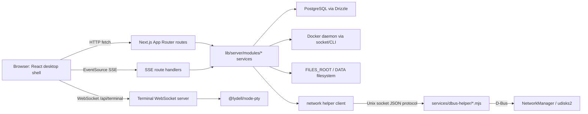
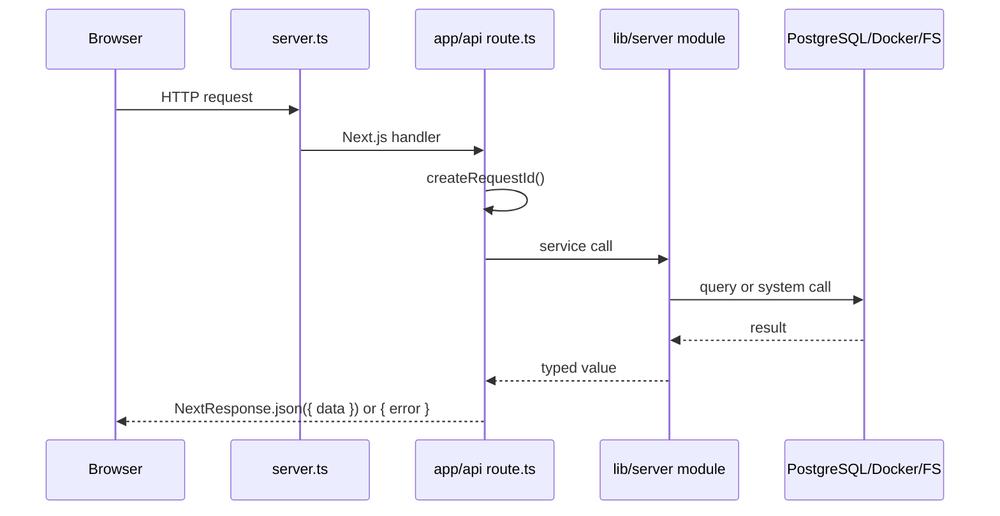
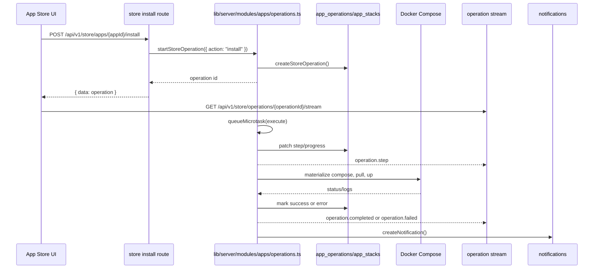

# Architecture

Homeio is a Next.js 16 App Router application hosted by a custom Node HTTP server. The same process serves pages, API routes, SSE streams, and the terminal WebSocket upgrade path. Server-only domain logic lives under `lib/server/`; client feature slices live under `modules/`; shared API contracts and query keys live under `lib/shared/`.

## Process Model

| Process | Entry point | Role | Communication |
|---|---|---|---|
| Main app dev process | `server.ts` via `npm run dev` | Next.js app, API routes, SSE, terminal WebSocket | HTTP, SSE, WebSocket, Docker socket/CLI, PostgreSQL |
| Main app production process | `dist-server/server.js` via `npm run start` | Compiled custom server | Same as dev |
| Docker database | `postgres:16-alpine` in `docker-compose.yml` | PostgreSQL persistence | TCP through `DATABASE_URL` |
| D-Bus helper sidecar | `services/dbus-helper/index.mjs` | NetworkManager/udisks2 bridge | Unix socket at `DBUS_HELPER_SOCKET_PATH`, then D-Bus |
| Docker daemon | host daemon | Compose app lifecycle, stats, logs | `/var/run/docker.sock` and Docker CLI |

`server.ts` wraps `next.getRequestHandler()` with `compression`, disables compression for stream paths, and attaches the terminal WebSocket server by importing `lib/server/modules/terminal/websocket-server.ts`.

## Startup Sequence

1. `server.ts` computes host/port from `HOMEIO_HTTP_HOST`, `HOMEIO_HTTP_PORT`, or `PORT`.
2. `next({ dev, hostname, port, turbopack: false })` is created.
3. `await app.prepare()` initializes Next.js.
4. `ensureFilesRootDirectories()` is imported from `lib/server/modules/files/path-resolver.ts` and run asynchronously.
5. `createServer()` creates the raw HTTP server.
6. `initializeWebSocketServer(server)` from `lib/server/modules/terminal/websocket-server.ts` attaches the `/api/terminal` upgrade handler.
7. `server.listen(port, hostname)` starts serving requests.
8. `SIGINT` and `SIGTERM` call `closeServerGracefully()` from `lib/server/http/graceful-shutdown.ts`.

## Request Lifecycles

### Standard HTTP API

Most routes return `{ data: ... }`, but current code is not fully uniform. Examples: `app/api/v1/files/route.ts` returns `{ data, meta }`; `app/api/v1/scheduled-tasks/route.ts` returns `{ tasks }`; auth routes use auth-specific shapes. New routes should prefer `{ data: ... }` and typed contracts in `lib/shared/contracts/`.

### SSE

SSE routes use `ReadableStream`, `toSseChunk()` from `lib/server/realtime/sse.ts`, `serverEnv.SSE_HEARTBEAT_MS`, and `request.signal` cleanup. Confirmed event names include:

| Route | Events |
|---|---|
| `app/api/v1/system/stream/route.ts` | `metrics.updated`, `heartbeat` |
| `app/api/v1/docker/stats/stream/route.ts` | `stats.updated`, `heartbeat` |
| `app/api/v1/apps/[appId]/logs/stream/route.ts` | `log.line`, `log.end`, `log.error`, `heartbeat` |
| `app/api/v1/store/operations/[operationId]/stream/route.ts` | `operation.step`, `operation.completed`, `operation.failed`, `heartbeat` |
| `app/api/v1/network/events/stream/route.ts` | network event type from `NetworkEvent`, `heartbeat` |
| `app/api/v1/notifications/stream/route.ts` | notification event type, `heartbeat` |
| `app/api/v1/files/usb/stream/route.ts` | USB event type, `heartbeat` |

### WebSocket Terminal

`lib/server/modules/terminal/websocket-server.ts` handles `upgrade` for `/api/terminal`. When `serverEnv.TERMINAL_WS_REQUIRE_AUTH` is true, it authenticates the `homeio_session` cookie via `authenticateSession()`. It starts a host PTY with `bash` or `powershell.exe`, supports Docker attach with `docker exec -it`, and enforces `TERMINAL_MAX_SESSIONS_PER_USER`, `TERMINAL_IDLE_TIMEOUT_MS`, and `TERMINAL_MAX_SESSION_MS`.

### App Install Operation

Operations run in-process via `queueMicrotask()` in `lib/server/modules/apps/operations.ts`. There is no external worker or queue limit.

## Boundaries

- `lib/server/**` is server-only. Files there must import `"server-only"` first.
- `lib/shared/**` is safe for client and server. API contracts and `queryKeys` belong here.
- `lib/ui/**`, `lib/desktop/**`, `lib/client/**`, and `modules/**` are client-facing unless a file is explicitly server-only.
- `@/*` maps to the repo root. It is convenient but dangerous: `@/lib/server/...` can be imported from client files unless the local `server-only` package catches it.

## Build Pipeline

| File | Purpose |
|---|---|
| `tsconfig.json` | Next.js TypeScript config, strict mode, `noEmit: true`, `@/*` alias |
| `tsconfig.server.json` | Compiles `server.ts`, `lib/server/**/*.ts`, and `lib/shared/**/*.ts` to CommonJS in `dist-server/` |
| `next.config.mjs` | Next build options; `NEXT_OUTPUT=standalone` enables standalone output for Docker |
| `package.json` | `npm run build` runs `next build` then `npm run build:server` |

`dist-server/` is the compiled custom Node server used by `npm run start` and the Docker runner. `tsc-alias` rewrites `@/*` aliases after the server build.

## Deployment Topology

- Docker Compose: `docker-compose.yml` runs `homeio` plus `db`; the app mounts `/var/run/docker.sock`, `/DATA`, and app stack storage.
- Bare-metal: `scripts/install.sh` installs the app, Nginx, and sidecar dependencies for Debian/Ubuntu/Raspberry Pi OS. Network and USB features depend on host D-Bus services.
- Development: `npm run dev` starts the custom server on `localhost:3000` unless overridden.

## Current Architecture Risks

- No central `middleware.ts`; API auth depends on each route calling `authenticateSession()`.
- `/api/v1/**` routes use `requireApiSession()` except documented OAuth bootstrap/callback routes.
- `lib/server/modules/docker/compose-runner.ts` is large and manipulates YAML textually.
- `lib/server/modules/apps/operations.ts` runs long operations in-process.
- Production builds fail on TypeScript errors; do not reintroduce `typescript.ignoreBuildErrors`.
